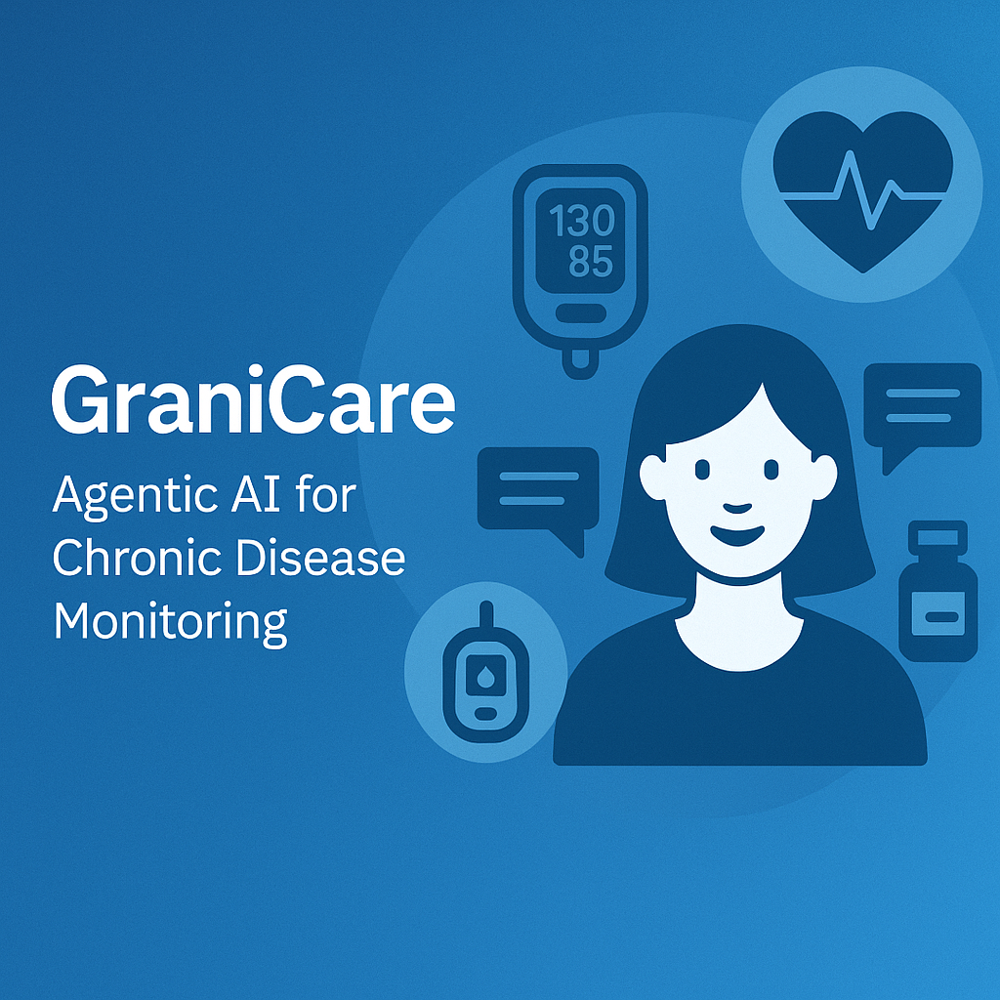

# Granicare-chronic-disease-tracker-ai-agent

GraniCare is an AI-powered agentic healthcare assistant designed to support patients with chronic diseases such as diabetes, hypertension, and cardiovascular conditions. Built using IBM Cloud Lite services and the Granite Foundation Model, this virtual assistant empowers users with personalized healthcare insights and real-time support to manage long-term medical conditions effectively.

The core functionality of GraniCare includes:

🔍 **Real-Time Health Monitoring**: Integrates patient inputs and wearable data to detect early warning signs.

🧠 **AI-Driven Insights**: Uses predictive analytics to deliver tailored health tips and detect potential health risks.

⏰ **Medication Reminders**: Ensures patients adhere to prescribed treatment and medication schedules.

🌿 **Lifestyle Recommendations**: Provides guidance on diet, physical activity, and stress management.

📋 **Patient Interaction UI**: Friendly interface where patients can interact, ask health-related queries, and receive instant responses.

The agent is trained on healthcare-specific data and refuses to answer unrelated queries like programming, academics, etc., maintaining a strict focus on health.

By acting as a bridge between patients and healthcare providers, GraniCare aims to:

📉 Reduce hospital visits and readmissions.

✅ Improve treatment adherence.

👩‍⚕️ Enhance doctor-patient communication.

🌐 Enable proactive and preventive care.

---

## 🧠 Problem Statement

An AI agent for chronic disease monitoring helps patients and healthcare providers manage long-term conditions effectively. It continuously analyzes health data from wearables, medical records, and patient inputs to detect early warning signs. Using AI and predictive analytics, it offers personalized insights, medication reminders, and lifestyle recommendations. The agent supports diseases like diabetes, hypertension, and heart conditions with real-time monitoring and alerts.
It enables proactive care, reduces hospital visits, and improves patient adherence to treatment plans. This intelligent assistant bridges the gap between patients and providers, enhancing chronic care outcomes.

---

## 💡 Proposed Solution

GraniCare proposes an intelligent, AI-powered healthcare assistant that leverages **RAG (Retrieval-Augmented Generation)** and **Granite Large Language Model (LLM)** technology, integrated with **IBM Cloud services**, to support patients with chronic diseases in a personalized and scalable way.

The core of the solution lies in combining **agentic AI** with **real-time health data retrieval** to ensure that users receive precise, contextual, and clinically relevant responses — not generic outputs. By embedding **Granite LLM** with a curated medical knowledge base and integrating **wearable health data inputs** (e.g., heart rate, glucose levels, BP), the system becomes an always-available, interactive assistant that can help patients better manage their conditions.

Key aspects of the proposed solution include:

* 🧠 **RAG-based Personalization**: Uses patient-specific data and dynamic health knowledge sources to answer queries with context-awareness and high accuracy.
* ⚙️ **Granite LLM Integration**: Ensures the assistant understands complex medical queries and generates insightful, safe, and human-like responses.
* ☁️ **IBM Cloud Services**: Enables scalable deployment, real-time monitoring, and secure data handling through services like IBM Watsonx.ai, Cloud Object Storage, and App ID.
* 🔁 **Continuous Learning & Feedback**: The assistant evolves with patient interactions, improving over time through user feedback and updated health data.
* 📶 **Agentic Workflow Automation**: Triggers alerts, reminders, or escalations based on symptom severity or abnormal data patterns, without human intervention.

This solution is not just a chatbot—it’s a **virtual health companion** that helps in **early detection of complications**, **promotes adherence to treatment**, and **bridges the gap** between patient self-care and professional medical support. It is particularly valuable for rural or underserved regions where regular medical access is limited.

With GraniCare, we envision a future where proactive care is made affordable, intelligent, and always within reach.

---

## 💻 Technologies Used

* IBM Watsonx.ai Studio 
* IBM Granite Foundation Model (LLM)
* IBM Watsonx.ai Runtime
* Vector Index for Retrieval-Augmented Generation
* NLP (Natural Language Processing)
* IBM Watsonx.ai + Granite FM
* LangChain for agent orchestration

---

## ☁️ IBM Cloud Services Used

* IBM Cloud Object Storage
* IBM Watsonx.ai Studio  
* IBM Granite Foundation Model (granite-3-3-8b-instruct)  
* IBM Cloud Lite Account 
* Vector Index (for data retrieval if extended)  
* IBM Cloud IAM
* IBM Code Engine (Optional for deployment)

---

## 👥 End Users

### 🧑‍⚕️ Chronic Disease Patients

* 24x7 virtual health assistant for non-emergency queries
* Personalized tips on diet, meds, and wellness
* Symptom tracking and reminders
* Multilingual, privacy-focused support

### 🩺 Doctors / Caregivers

* AI-powered patient summaries and alerts
* Handles routine queries, improves efficiency
* Supports remote monitoring and follow-ups
* Easy integration with EHR systems

### 🧪 Health-Tech Researchers

* Real-world Agentic AI healthcare application
* Built with RAG + IBM Granite LLM
* Extensible for experiments, model testing, and innovation
* Ideal for research, ethical AI, and digital health prototypes

---

## 🌟 WOW Factors

* 🧠 **Contextual Agentic Responses** – Understands patient history, queries, and context for meaningful replies
* 🌿 **Personalized Lifestyle Suggestions** – Tailors recommendations for diet, sleep, stress, and exercise
* 🕐 **Always-On Healthcare Companion** – Available 24x7 to assist anytime, anywhere
* ⛑️ **Early Risk Detection** – Uses predictive analytics to warn about potential health risks
* 💊 **Medication Adherence Tracking** – Smart reminders based on prescription timelines
* 📲 **Wearable Integration Ready** – Connects with health devices for real-time vitals monitoring
* 🗂️ **Privacy-First Design** – Maintains strict patient data confidentiality
* 🧬 **Granite LLM + RAG Powered** – Combines retrieval-based reasoning with robust AI for accurate answers
* 🌐 **Multilingual Support** – Interacts in native/regional languages for wider accessibility
* 🤝 **Human-in-the-Loop Support** – Escalates to real doctors when needed

---

## ✨ Key Features

* Custom Agent Instructions
* Question Restrictions (domain-limited)
* Voice/text interaction
* Dashboard for patients & providers

---

## ⚙️ How It Works

1. Patient initiates query
2. Agent fetches relevant healthcare data from vector DB
3. Responds using Granite model
4. Tracks medication, symptoms & follow-ups

---

## 🖼️ Screenshots

# **Setting Up**

### IBM Dashboard

### IBM Watsonx

### IBM Cloud Object Storage

### Create Project

### IBM Watsonx.ai Runtime

### Auto AI

### Foundational Model

### Granicare: Agentic AI

* Advanced Configuration
   * Agent Instructions
     

   * Common Instructions
     

* Vector Document
   

* Tools
   
  

# **Testing**  

# **Deployment & API Reference**
     

# **Preview**

# **Resource List**

---

## 🚀 How to Run or Deploy

1. **Log in to IBM Cloud Lite**: [https://cloud.ibm.com](https://cloud.ibm.com)  
2. **Launch Watsonx.ai Studio**  
3. **Create a new AI Agent**  
4. **Upload financial PDFs to a Vector Index** *(skip for now unless needed)*  
5. **Choose tools**: Google Search, Wikipedia, DuckDuckGo, Weather  
6. **Configure Agent Instructions**:  
   - Define scope  
   - Restrict non-travel queries  
7. **Test in the preview panel**  
8. **Deploy via**:  
   - Web snippet  
   - Streamlit  
   - Custom web UI

---

## 🔮 Future Scope

* Multilingual support – Enable conversation in regional and global languages for wider reach
* Integration with wearable devices – Real-time monitoring from smartwatches, fitness bands, etc.
* Emergency alert system – Instant alerts to caregivers, doctors, or emergency services
* Hospital Information System (HIS) integration – Seamless sync with hospital databases and patient records
* Advanced predictive analytics – Use AI to forecast chronic illness flare-ups and health trends
* Genetic risk analysis – Incorporate genetic data to assess personalized health risks
* Voice assistant interface – Voice-enabled interaction for accessibility and ease of use
* Progressive health reports – Generate monthly health insights and trends in visual format
* Mental health support module – Add AI-driven assistance for stress, anxiety, and emotional wellness
* Insurance API integration – Automated claims assistance and eligibility checks
* Blockchain-based medical records – Tamper-proof and transparent health data management
* Virtual doctor collaboration – Enable patients to consult with verified healthcare professionals directly

---

## 🔗 Useful Links

* [IBM Cloud Lite](https://cloud.ibm.com)
* [IBM Watsonx.ai](https://www.ibm.com/products/watsonx)
* [IBM SkillsBuild](https://skillsbuild.org/)

---

## 📝 License

This project is licensed under the **MIT License**.

---

## 🤝 Connect with Me

**[Shalini Verma – LinkedIn](https://www.linkedin.com/in/shalini-verma-35b0a7261/)**
Developed as part of the **IBM SkillsBuild for Academia Internship 2025** by Shalini Verma.
